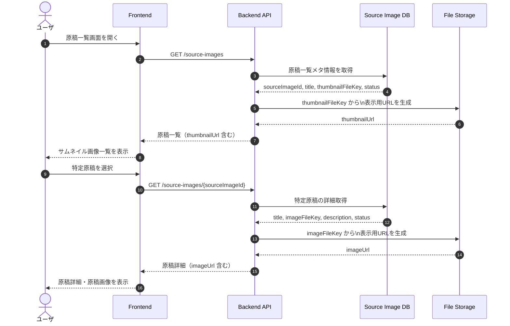

```mermaid
sequenceDiagram
    autonumber

    actor User as ユーザ
    participant FE as Frontend
    participant API as Backend API
    participant SIDB as Source Image DB
    participant FS as File Storage

    User ->> FE: 原稿一覧画面を開く
    FE ->> API: GET /source-images

    API ->> SIDB: 原稿一覧メタ情報を取得
    SIDB -->> API: sourceImageId, title, thumbnailFileKey, status

    API ->> FS: thumbnailFileKey から\n表示用URLを生成
    FS -->> API: thumbnailUrl

    API -->> FE: 原稿一覧（thumbnailUrl 含む）
    FE -->> User: サムネイル画像一覧を表示

    User ->> FE: 特定原稿を選択
    FE ->> API: GET /source-images/{sourceImageId}

    API ->> SIDB: 特定原稿の詳細取得
    SIDB -->> API: title, imageFileKey, description, status

    API ->> FS: imageFileKey から\n表示用URLを生成
    FS -->> API: imageUrl

    API -->> FE: 原稿詳細（imageUrl 含む）
    FE -->> User: 原稿詳細・原稿画像を表示
```