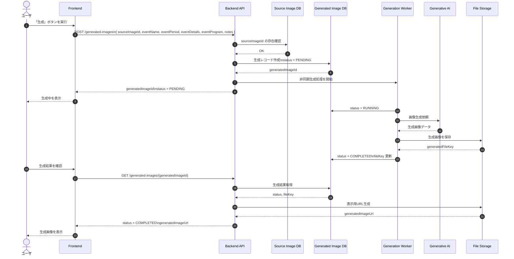

```mermaid
sequenceDiagram
    autonumber

    actor User as ユーザ
    participant FE as Frontend
    participant API as Backend API
    participant SIDB as Source Image DB
    participant GIDB as Generated Image DB
    participant Worker as Generation Worker
    participant AI as Generative AI
    participant FS as File Storage


    User ->> FE: 「生成」ボタンを実行
    FE ->> API: POST /generated-images\n{ sourceImageId, eventName, eventPeriod, eventDetails, eventProgram, notes }

    API ->> SIDB: sourceImageId の存在確認
    SIDB -->> API: OK

    API ->> GIDB: 生成レコード作成\nstatus = PENDING
    GIDB -->> API: generatedImageId

    API ->> Worker: 非同期生成処理を開始
    API -->> FE: generatedImageId\nstatus = PENDING
    FE -->> User: 生成中を表示

    Worker ->> GIDB: status = RUNNING
    Worker ->> AI: 画像生成依頼
    AI -->> Worker: 生成画像データ

    Worker ->> FS: 生成画像を保存
    FS -->> Worker: generatedFileKey

    Worker ->> GIDB: status = COMPLETED\nfileKey 更新

    User ->> FE: 生成結果を確認
    FE ->> API: GET /generated-images/{generatedImageId}

    API ->> GIDB: 生成結果取得
    GIDB -->> API: status, fileKey

    API ->> FS: 表示用URL生成
    FS -->> API: generatedImageUrl

    API -->> FE: status = COMPLETED\ngeneratedImageUrl
    FE -->> User: 生成画像を表示
```